```{r setup, include=FALSE}
options(htmltools.dir.version = FALSE)
#devtools::install_github("hadley/emo")
# devtools::install_github("rstudio/fontawesome")
library(emo)
library(fontawesome) # from github: https://github.com/rstudio/fontawesome
```

layout: true
  
<div class="my-footer"><span><a href="https://cgranell.github.io/sbide2020/index.html">cgranell.github.io/sbide2020</a></span></div>

---
class: inverse, center, middle

# EL DESAFíO

--

### [TRANSFORMACIÓN DIGITAL]() 

---

# .center[La digitalización NO es algo NUEVO]

.center[]


---

# .center[*e-Gov* `r emo::ji("east")` *Digital government*]

.center[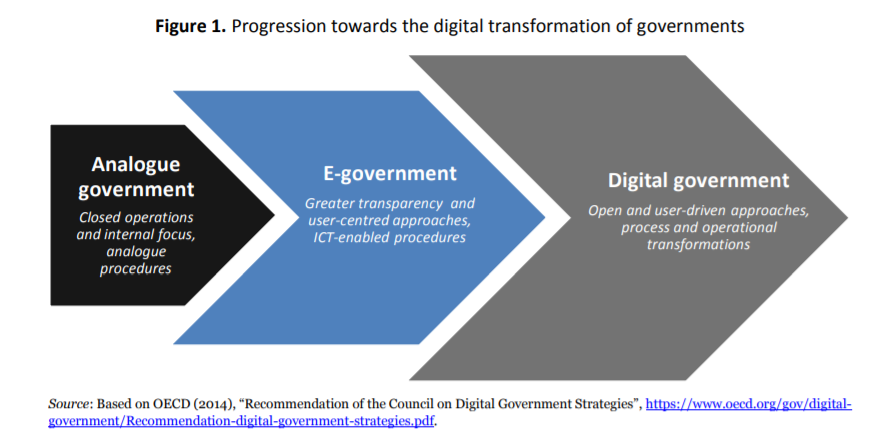]


---

.left-column[
### Seis Dimensiones (2014)
]

.right-column[
.center[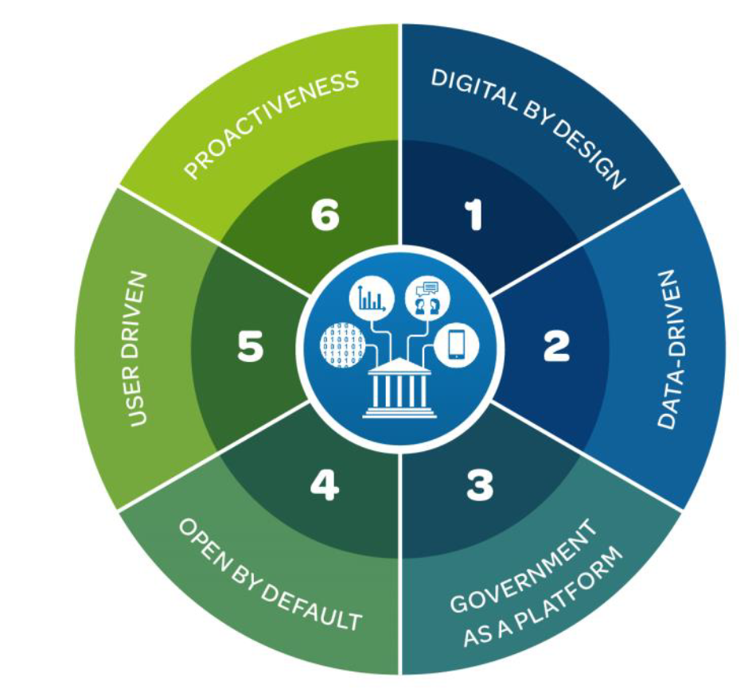]


1. From digitalisation of existing processes to **digital by design** 

1. From an information-centred governemnt to a **data-driven** public sector

1. From goverment as a service provider to **government as a platform** for public value co-creation

1. From access to information to **open by default**

1. From a user-centred to a **user-driven** administration

1. From reactive to **proactive** policymaking and service delivery
]

???
Fuente: [The OECD Digital Government Policy Framework: Six dimensions of a Digital Government](https://doi.org/10.1787/f64fed2a-en)

---

.left-column[
  ### Seis Dimensiones (2014)
  ### Mundo (2019)
]

.right-column[
.center[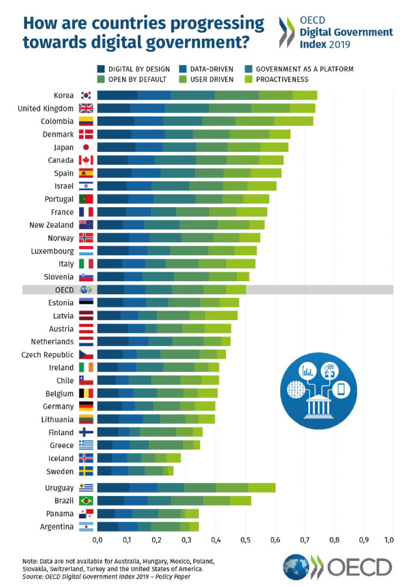]
]

???
Fuente: [Digital Government Index: 2019 results](https://doi.org/10.1787/4de9f5bb-en)

---

.left-column[
  ### Seis Dimensiones (2014)
  ### Mundo (2019)
  ### Am Latina (2019)
]

.right-column[
.center[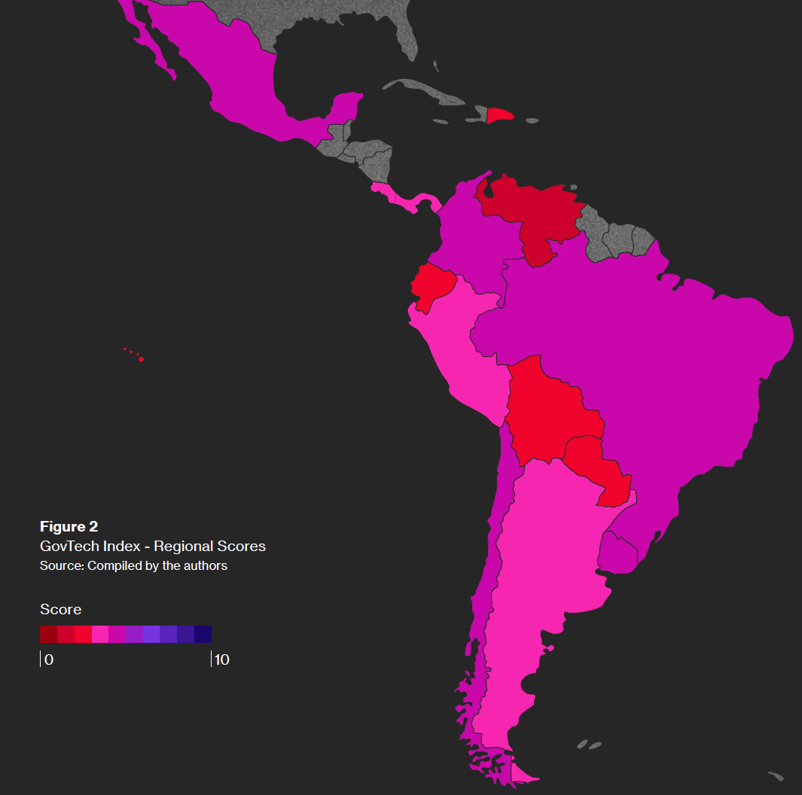]
]

???
Fuente: [The GovTech Index 2020: Unlocking the Potential of GovTech Ecosystems in Latin America, Spain and Portugal](https://scioteca.caf.com/handle/123456789/1580)

---

.left-column[
  ### Seis Dimensiones (2014)
  ### Mundo (2019)
  ### Am Latina (2019)
]

.right-column[
.center[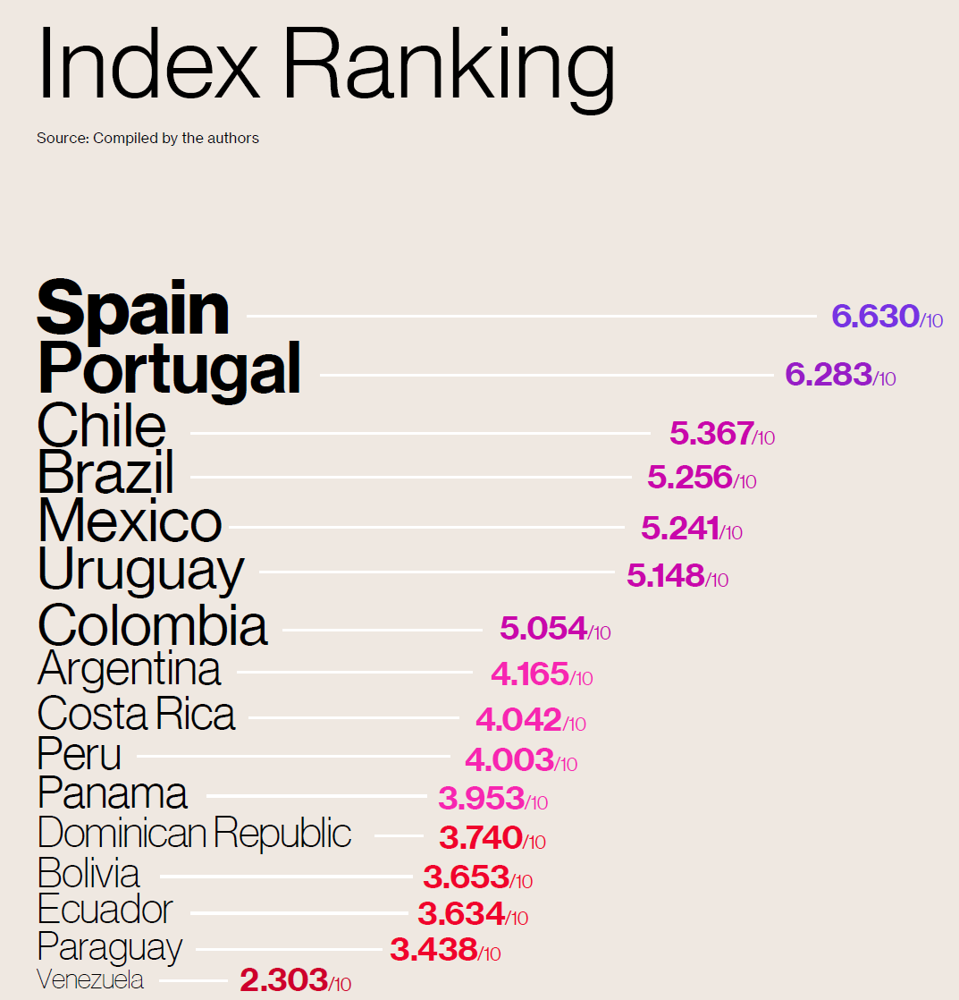]
]

???
Fuente: [The GovTech Index 2020: Unlocking the Potential of GovTech Ecosystems in Latin America, Spain and Portugal](https://scioteca.caf.com/handle/123456789/1580)

---

.left-column[
  ### Seis Dimensiones (2014)
  ### Mundo (2019)
  ### Am Latina (2019)
  ### Brasil (Nov 2018)
]

.right-column[
.center[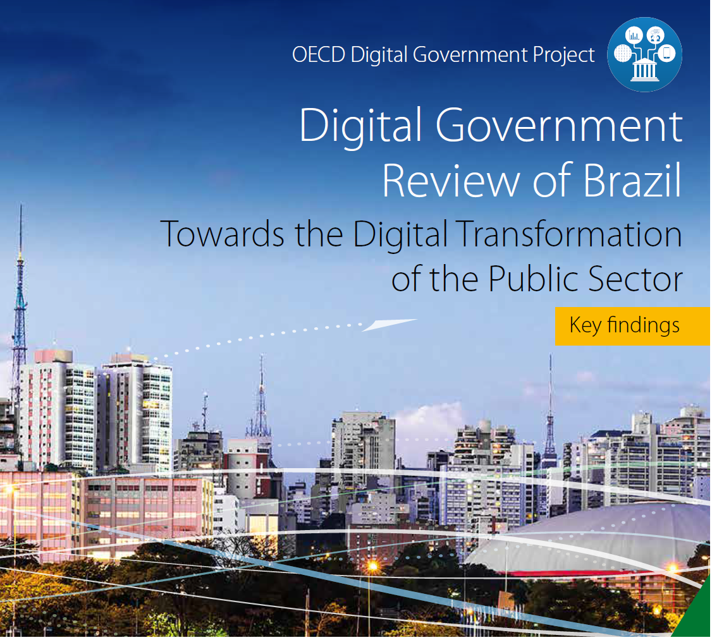]
]

???
Fuente: [Digital Government Review of Brazil: Towards the Digital Transformation of the Public Sector, 2018](https://doi.org/10.1787/9789264307636-en)

---

.left-column[
  ### Seis Dimensiones (2014)
  ### Mundo (2019)
  ### Am Latina (2019)
  ### Brasil (Nov 2018)
]

.right-column[
.center[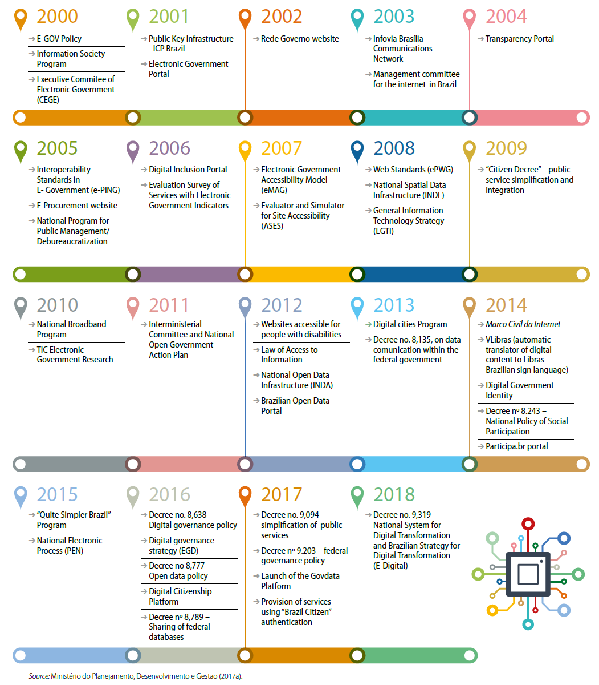]
]

???
Fuente: [Digital Government Review of Brazil: Towards the Digital Transformation of the Public Sector, 2018](https://doi.org/10.1787/9789264307636-en)

---
class: inverse, center, middle

# Y algo pasó... 

---

.center[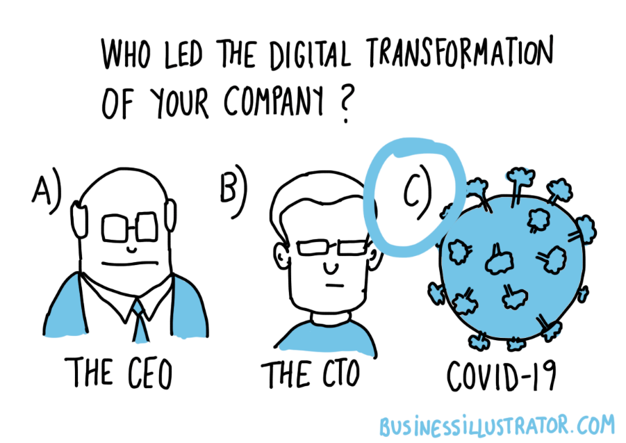]


---

# .center[La Transformación Digital]

.pull-left[

### .center[Antes COVID]

era una política a **medio-largo plazo**, centrada en la eficiencia, ahorro de costes, mejora de servicios públicos, infraestructura tecnológica, despliegue redes comunicaciones, etc. 

]

.pull-right[

### .center[Durante/después COVID]

es **LA CLAVE a corto plazo** para acelerar una recuperación económica

]

---

.left[]
???
Fuente: [The Conversation, 19 jun 2020](https://theconversation.com/la-digitalizacion-en-la-era-de-la-covid-19-irreversible-y-sin-panos-calientes-140757)

--

.center[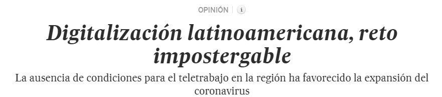]
???
Fuente: [El Pais, 22 ago 2020](https://elpais.com/economia/2020-08-22/digitalizacion-latinoamericana-reto-impostergable.html)

--

.right[]
???
Fuente: [The Conversation, 6 oct 2020](https://theconversation.com/2020-el-ano-que-acelero-la-transformacion-digital-147246) 

---

.pull-left[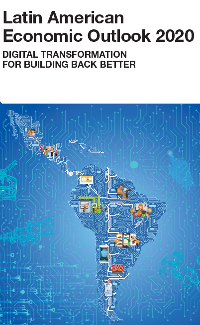]

.pull-right[.middle[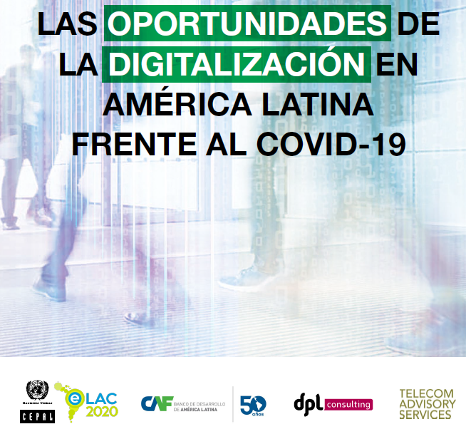]]

???
Fuentes: [Latin American Economic Outlook 2020: Digital Transformation for Building Back Better](https://doi.org/10.1787/e6e864fb-en) y [Las oportunidades de la digitalización en América Latina frente al COVID-19](https://repositorio.cepal.org/handle/11362/45360)

---
class: inverse, center, middle

# PERO...

---
class: inverse, center, middle


# el `r emo::ji("world")` ahora está PEOR que hace unos meses!

???
Partimos de una situación peor, no solo económica sino social (mayou pobreza, vulnerabilidad). Hay que intentar que nadie se quede atrás. 

---

.center[]

.pull-left[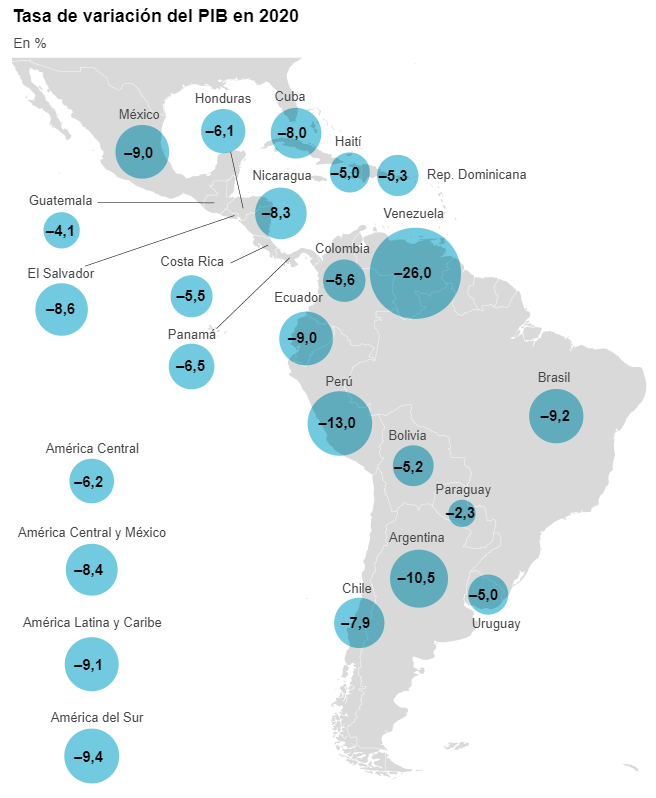]

--

.pull-right[
.pull-left[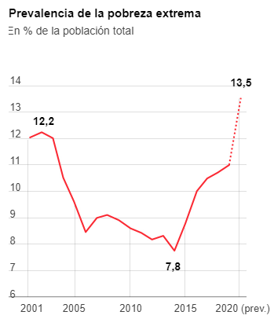]
.pull-right[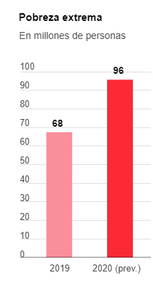]
]


???
Fuente: [El País, 29 oct 2020](https://elpais.com/economia/2020-08-29/america-latina-vuelta-al-punto-de-partida.html)

---
class: middle, center

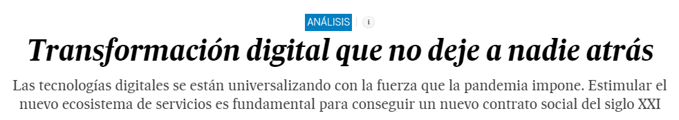

???
Fuente: [El País, 6 ago 2020](https://elpais.com/elpais/2020/08/06/planeta_futuro/1596731545_633252.html) 

---
class: inverse, center, middle

# LA OPORTUNIDAD

--

### [INFRAESTRUCTURAS DE DATOS ESPACIALES]()


---

.center[]

### .center[Reflexión sobre el *futuro* de la IDE]

--

### .center[Reflexion sobre el *papel* de la IDE en la Transformación Digital]

---

# Digital Gov Review of Brazil (Nov 2018)

.left-column[
  ### *INDE* es parte de la Transformación Digital en Brasil (ver 2008)
]

.right-column[
.center[]
]

???
Fuente: [Digital Government Review of Brazil: Towards the Digital Transformation of the Public Sector, 2018](https://doi.org/10.1787/9789264307636-en)

---

# El rol de las IDE (segun EU)

.left-column[
  ### 29 países
]

.right-column[
.center[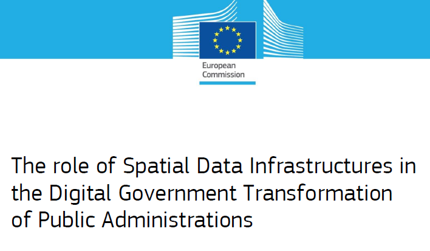]
]

???
Fuente: [The role of Spatial Data Infrastructures in the Digital Government Transformation of Public Administrations](https://op.europa.eu/s/omJu)

---

# El rol de las IDE (segun EC)

.left-column[
  ### 29 países
  ### 17 indicadores
]

.right-column[
.center[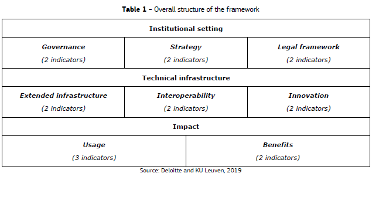]
]

???
Fuente: [The role of Spatial Data Infrastructures in the Digital Government Transformation of Public Administrations](https://op.europa.eu/s/omJu)

---

# El rol de las IDE (segun EU)

.left-column[
  ### 29 países
  ### 17 indicadores
  ### Resultados
]

.right-column[
.center[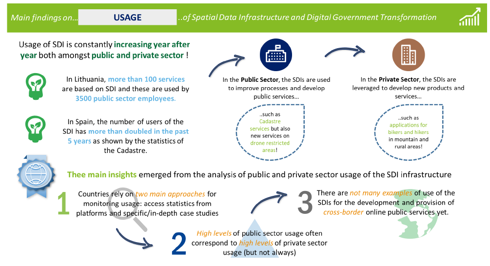]
]

???
Fuente: [The role of Spatial Data Infrastructures in the Digital Government Transformation of Public Administrations](https://op.europa.eu/s/omJu)


---

# El rol de las IDE (Am Latina)

.pull-left[]

.pull-right[.middle[]]

???
Fuentes: [Latin American Economic Outlook 2020: Digital Transformation for Building Back Better](https://doi.org/10.1787/e6e864fb-en) y [Las oportunidades de la digitalización en América Latina frente al COVID-19](https://repositorio.cepal.org/handle/11362/45360). En el primero, no se mencion IDE; en el segun hay unas pocas refencias sobre apps en la COVD.


---
class: inverse, center, middle

# La ACCIÓN 

--

### [IDE y Transformación Digital]() `r emo::ji("love")`


---
class: middle, center
# `r emo::ji("family")` Capital Humano

### educación, capacitación, curriculum educativo, habilidades digitales, ...

---
class: middle, center
# `r emo::ji("police")` Marco Legislativo

### regulación, legislacion, marco institucional, interoperabilidad, ...

---
class: middle, center
# `r emo::ji("link")` Plataforma Digital

### Plataforma facilitadora y generativa de valor, interconexión gobierno-empresa-sociedad, sinergías tecnologias, etc...


> Infraestructura: estructura que sirve de base de sustentación a otra.


> Plataforma: entorno informático que utiliza sistemas compatibles entre sí

---
class: middle, center
# `r emo::ji("talk")` Divulgación

### ganar confianza de la ciudadanía, no dejar a nadie atrás, etc. 


---
class: right, middle

### Find me at...

[`r fontawesome::fa(name = "github")` @cgranell](http://github.com/cgranell)  
[`r fontawesome::fa(name = "link")` carlosgranell.eu](https://carlosgranell.eu)  
[`r fontawesome::fa(name = "paper-plane")` carlos.granell@uji.es](mailto:carlos.granell@uji.es)

### Find slides at...

[`r fontawesome::fa(name = "link")` cgranell.github.io/sbide2020](https://cgranell.github.io/sbide2020/index.html)  

### Find sources at...

[`r fontawesome::fa(name = "github")` github.com/cgranell/sbide2020](https://github.com/cgranell/sbide2020)  


