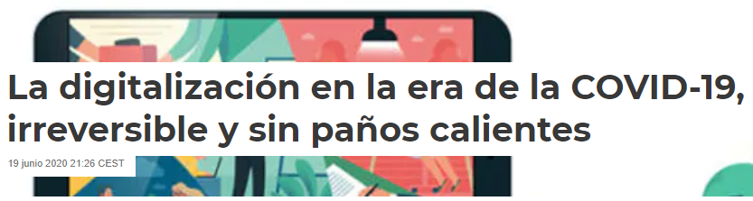
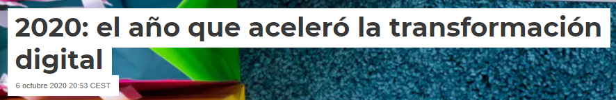
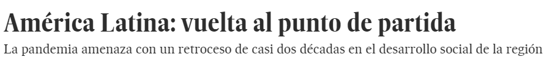

```{r setup, include=FALSE}
options(htmltools.dir.version = FALSE)
devtools::install_github("hadley/emo")

# library(fontawesome) # from github: https://github.com/rstudio/fontawesome
```

class: inverse, center, middle

# EL DESAFíO

--

### [TRANSFORMACIÓN DIGITAL]() 

---

# .center[La digitalización NO es algo NUEVO]

.center[]


---

# .center[*e-Gov* `r emo::ji("east")` *Digital government*]

.center[]


---

.left-column[
### Seis Dimensiones (2014)
]

.right-column[
.center[]


1. From digitalisation of existing processes to **digital by design** 

1. From an information-centred governemnt to a **data-driven** public sector

1. From goverment as a service provider to **government as a platform** for public value co-creation

1. From access to information to **open by default**

1. From a user-centred to a **user-driven** administration

1. From reactive to **proactive** policymaking and service delivery
]

---

.left-column[
  ### Seis Dimensiones (2014)
  ### Mundo (2019)
]

.right-column[
.center[]
]

---

.left-column[
  ### Seis Dimensiones (2014)
  ### Mundo (2019)
  ### Am Latina (2019)
]

.right-column[
.center[]
]

---

.left-column[
  ### Seis Dimensiones (2014)
  ### Mundo (2019)
  ### Am Latina (2019)
]

.right-column[
.center[]
]

---

.left-column[
  ### Seis Dimensiones (2014)
  ### Mundo (2019)
  ### Am Latina (2019)
  ### Brasil (Nov 2018)
]

.right-column[
.center[]
]

---

.left-column[
  ### Seis Dimensiones (2014)
  ### Mundo (2019)
  ### Am Latina (2019)
  ### Brasil (Nov 2018)
]

.right-column[
.center[]
]

---
class: inverse, center, middle

# Y algo pasó... 

---

.center[]


---

# .center[La Transformación Digital]

.pull-left[

### .center[Antes COVID]

era una política a **medio-largo plazo**, centrada en la eficiencia, ahorro de costes, mejora de servicios públicos, infraestructura tecnológica, despliegue d redes comunicaciones, etc. 

]

.pull-right[

### .center[Durante/después COVID]

es **LA CLAVE** para acelerar una recuperación económica

]

---

.left[]
???
Fuentes: 

--

.center[]
???
Fuentes: 

--

.right[]
???
Fuentes: 

---

.pull-left[]

.pull-right[.middle[]]

???
Fuentes:

---
class: inverse, center, middle

# PERO...

---
class: inverse, center, middle


# el `r emo::ji("world")` ahora está PEOR que hace unos meses!

???
Partimos de una situación peor, no solo económica sino social (mayou pobreza, vulnerabilidad). Hay que intentar que nadie se quede atrás. 

---

.center[]

.pull-left[]

--

.pull-right[
.pull-left[]
.pull-right[]
]


???
Fuente: [El País, 29 Oct 2020](https://elpais.com/economia/2020-08-29/america-latina-vuelta-al-punto-de-partida.html)

---
class: middle, center


???
Fuente: [El País, 6 Ago 2020](https://elpais.com/elpais/2020/08/06/planeta_futuro/1596731545_633252.html) 

---
class: inverse, center, middle

# LA OPORTUNIDAD

--

### [IDE]()


---
class: inverse, center, middle

# La ACCIÓN 

--

### [IDE como _plataformas_ de la Transformación Digital]()


---

class: right, middle


# Find me at...


